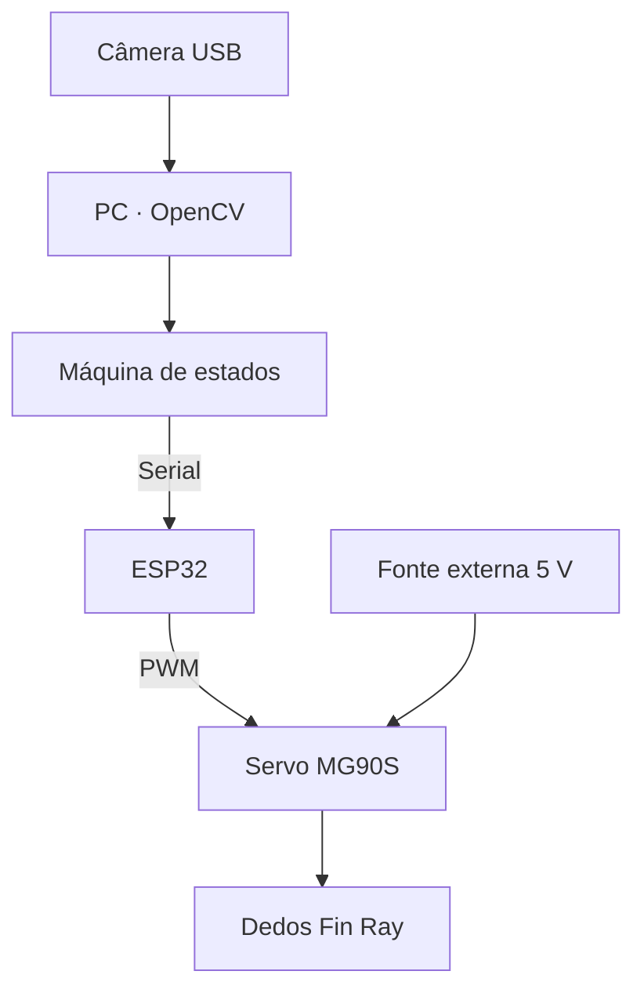

# Garra Fin Ray

Projeto de uma garra flexível com dedos inspirados no efeito Fin Ray, atuação por servo e integração futura com visão computacional. A proposta explora como a deformação mecânica pode facilitar a apreensão de objetos.

**Status: 🟡 Design documentado — projeto pausado, sem implementação física confirmada.**

## Problema

Garras rígidas podem exigir posicionamento preciso e adaptação à geometria de cada objeto. Este projeto propõe investigar uma alternativa complacente, capaz de se deformar durante o contato.

## Solução proposta

Fabricar dedos flexíveis em TPU, montados em uma estrutura rígida e acionados por servo. O desenvolvimento começaria pela abertura e fechamento da garra em bancada.

Uma etapa posterior prevê câmera USB, OpenCV e comunicação serial com ESP32 para integrar percepção e atuação. Um sistema completo de pick-and-place continua sendo um objetivo, não uma capacidade construída.

## Arquitetura prevista

A visão seria processada no PC; o ESP32 controlaria o servo. A mecânica necessária para posicionar e transportar objetos ainda precisa ser definida.

## Tecnologias previstas

- ESP32 DevKit e servo MG90S.
- PWM e comunicação serial.
- Python/OpenCV para cor, contornos e calibração.
- Máquina de estados para integração.
- Impressão 3D em TPU para dedos e material rígido para suportes.

## Status real

**Já documentado:** conceito, arquitetura inicial, componentes sugeridos e etapas de desenvolvimento.

**Ainda pendente:** aquisição de componentes, fabricação, firmware, pipeline de visão e ensaios. Não há código, CAD, fotos de montagem ou resultados experimentais publicados aqui.

A página mais recente do projeto no Notion, de 29/08/2026, registra o trabalho **parado desde 12/04**, com documentação preparada e hardware/firmware não desenvolvidos. Essa atualização prevalece sobre o texto antigo que anunciava “fase de prototipagem”.

Taxa de sucesso, tempo de ciclo e tolerância de posicionamento são metas de estudo; não são resultados medidos.

## Próximos passos

1. Retomar o kit mínimo e validar alimentação e PWM do servo.
2. Definir a geometria dos dedos e fabricar uma primeira amostra.
3. Medir apreensão, deformação e limites mecânicos em bancada.
4. Integrar visão e serial somente após a validação básica da garra.

## Documentação

[Escopo técnico e decisões pendentes](docs/design.md).

João Pedro de Lima Campos — Engenharia de Controle e Automação, UFMT.
